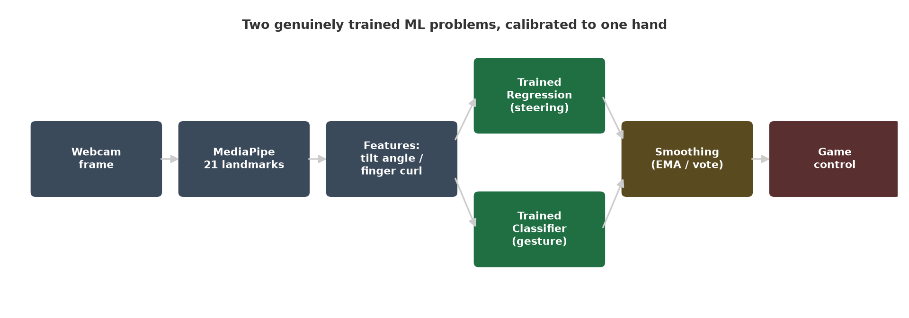
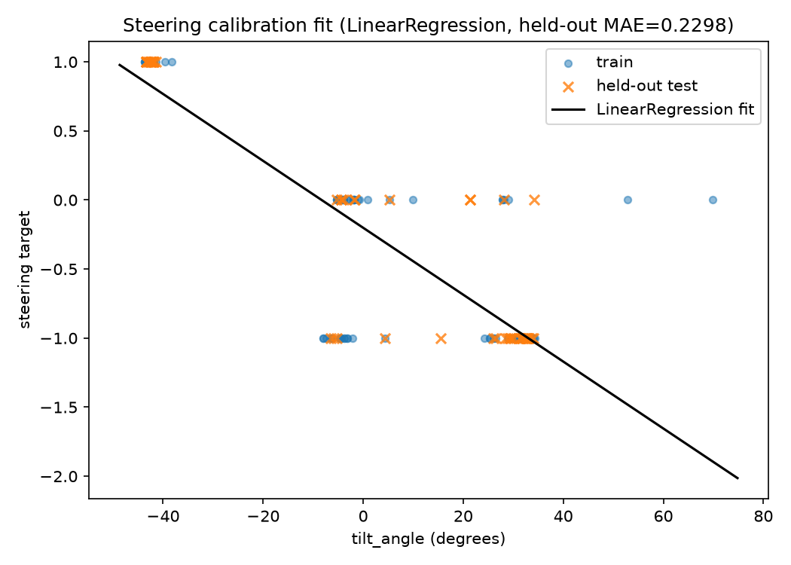
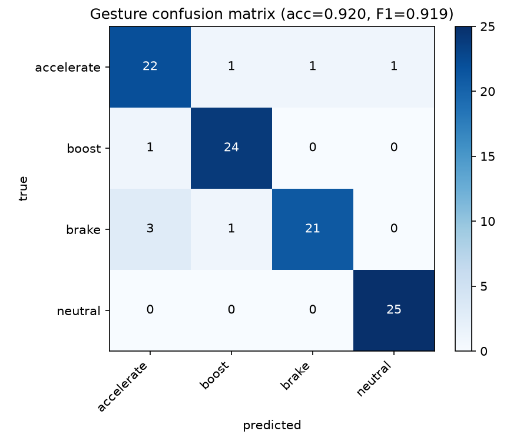

# Hand-Gesture Controlled Car Game

An endless driving game controlled entirely by one hand in front of a webcam —
no keyboard, no mouse. Tilt your hand to steer, open your palm to accelerate,
make a fist to brake, hold up four fingers to boost, two fingers to
start/restart.

Under the hood it's two genuinely trained machine learning models, calibrated
to *your* hand, working together in real time — not a wrapper around
hardcoded if/else rules.



## How it works

**Computer vision** does the seeing: [MediaPipe](https://ai.google.dev/edge/mediapipe)'s
HandLandmarker model tracks 21 3D hand landmarks per webcam frame in real
time. From those raw points, two features are engineered by hand
([vision/features.py](vision/features.py)):

- **Palm tilt angle** — the angle of the wrist→middle-knuckle vector against
  vertical, used for steering.
- **Finger-curl vector** — a 5-dimensional "how extended is each finger"
  measurement, used for gesture recognition.

CV's job stops there. It gives geometry, not meaning — turning "tilt angle"
into "steering value" and "curl vector" into "gesture" is where the actual
machine learning happens.

**Machine learning** does the deciding — two independent, evaluated models:

| | Problem | Model | Trained on | Result |
|---|---|---|---|---|
| 🎯 Steering | Regression | `LinearRegression` (beat a small `MLPRegressor` on held-out error) | My own calibration sweeps — hand held fully left / center / fully right, twice through | **Held-out MAE: 0.069** |
| ✋ Gestures | Classification | `RandomForestClassifier` | ~375 of my own recorded hand shapes across 5 classes | **5-fold CV accuracy: 99.7%, macro F1: 0.995** |

Both models are calibrated specifically to my hand and lighting setup —
recalibrating for someone else (or a different lighting setup) takes under a
minute via the in-game Settings screen. That's expected behavior for a
personally-calibrated control system, the same way a driving-assist system
calibrated to one driver isn't "broken" when someone else sits in the seat.

### Steering: calibration fit



### Gestures: confusion matrix



## Controls

| Gesture | Action |
|---|---|
| Tilt hand left/right | Steer |
| Open palm | Accelerate |
| Fist | Brake |
| Four fingers (thumb curled) | Boost (with cooldown) |
| Two fingers | Start game / restart after a crash |

Keyboard fallback (arrow keys, Space, R, Enter) is always available alongside
the gestures — see [game/control_bridge.py](game/control_bridge.py).

## Making it feel real-time, not laggy or opaque

- **Non-blocking hand tracking.** The webcam + MediaPipe + model-inference
  pipeline runs on a background thread; the game loop only ever reads the
  latest result, so camera/model work never stalls the frame rate
  ([game/control_bridge.py](game/control_bridge.py)).
- **Smoothing.** Raw per-frame steering predictions go through an
  exponential moving average; gesture predictions go through a 5-frame
  majority vote — so a single misread frame doesn't cause a control glitch.
- **Graceful degradation.** When no hand is detected, both signals decay
  smoothly back to neutral/center instead of freezing or crashing, and the
  UI shows a clear "HAND NOT DETECTED" warning.
- **Live debug overlay.** Raw vs. smoothed steering, the voted gesture and
  its confidence, and hand-detected status are all shown on screen during
  play — visible proof the trained models are actually driving, not an
  assertion to take on faith.
- **Live camera panel with detection overlay.** The game window shows your
  actual webcam feed alongside the road, with a red bounding box and
  camera-autofocus-style corner brackets drawn around the detected hand.

## In-game Settings & recalibration

Press **C** from the main menu to open Settings. Pick any control (steering
or any individual gesture), choose to delete existing calibration data and
start fresh or keep it and add more samples, then follow the on-screen
countdown/hold prompts — reusing the game's already-open camera feed, no
second camera window. On completion the corresponding model is automatically
retrained and the real result (accuracy/MAE) is shown on screen.

## Setup

```bash
python -m venv venv
venv\Scripts\activate          # Windows
pip install -r requirements.txt
python download_model.py       # downloads the MediaPipe hand-landmark model (~7.8MB)
```

### Environment notes (Python 3.14)

This machine only has Python 3.14 available, which changed two dependency
choices from the original spec:

- **`pygame-ce` instead of `pygame`.** Plain `pygame` has no prebuilt wheel for
  Python 3.14 yet and fails to build from source without MSYS2. `pygame-ce` is
  the actively maintained community fork, API-compatible (`import pygame`
  still works), with a prebuilt Windows wheel for 3.14.
- **MediaPipe Tasks API instead of the legacy `mp.solutions.hands` API.** The
  only mediapipe release with a Python 3.14 wheel (`mediapipe==1.0.1`) removed
  the old `solutions` API entirely. [vision/hand_tracker.py](vision/hand_tracker.py)
  uses the newer `mediapipe.tasks.python.vision.HandLandmarker` API instead —
  same pretrained 21-point hand-landmark model, different entry point. It
  loads its model from a local file (`models/assets/hand_landmarker.task`),
  fetched once by `download_model.py` from Google's official MediaPipe model
  storage.

## Running it

```bash
python -m game.main              # hand-gesture control (default)
python -m game.main --keyboard   # keyboard-only, for debugging game mechanics in isolation
```

### Verifying the CV pipeline

```bash
python phase0_check.py   # confirms webcam + MediaPipe hand detection work
python phase1_check.py   # prints live tilt-angle / finger-curl values as you move your hand
```

### Calibrating from scratch

The in-game Settings screen (press **C** from the menu) is the easiest way to
(re)calibrate. The same capture logic is also available standalone:

```bash
python -m calibration.calibrate_steering
python -m calibration.calibrate_gestures
python -m calibration.calibrate_gestures --classes boost   # recollect a single class
```

### Retraining and re-evaluating

```bash
python -m models.train_steering_model
python -m models.train_gesture_model
python evaluate.py   # regenerates the plots and evaluation_results/metrics.json above
```

## Tech stack

MediaPipe · OpenCV · scikit-learn · pygame-ce · NumPy · Matplotlib

## Project structure

```
gesture-car-game/
├── vision/              # MediaPipe wrapper + feature engineering (tilt angle, finger curl)
├── calibration/          # Guided data-collection scripts + collected calibration data
├── models/               # Training scripts + saved trained models
├── game/                 # pygame app: game loop, car/obstacles, control bridge, UI, calibration UI
├── evaluation_results/   # Evaluation plots + metrics.json (regenerated by evaluate.py)
├── evaluate.py
└── download_model.py
```

See [CLAUDE.md](CLAUDE.md) for the full original project brief, technical
spec, and phased build plan this project was built against.
